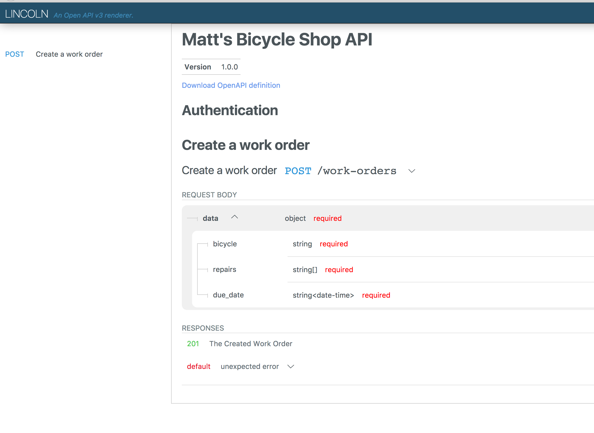
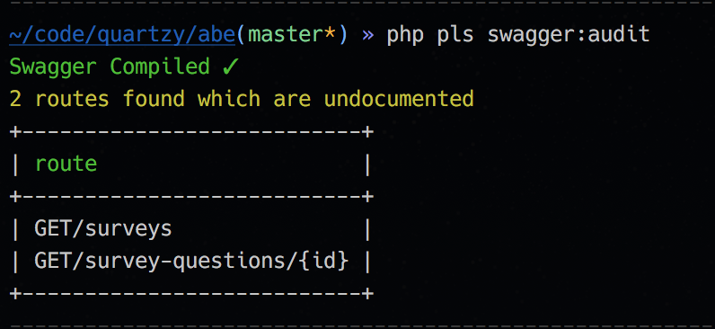
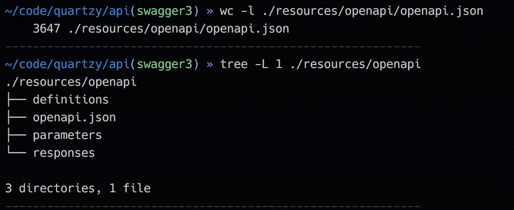
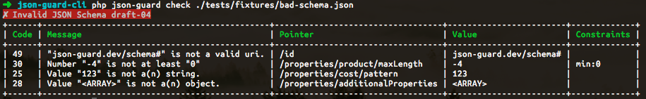

build-lists: true

# Documentation First APIs

### (With Lumen)

---

[.build-lists: false]

# About Me


- API Developer at Quartzy
- 4 Laravel Apps (Mostly Lumen) & a Symfony App
- > 200 API endpoints

---


^ ...going to talk about how I have been using Swagger to design and build APIs.

---

# [fit] documentation | code ?

^ At first swagger seems like documentation but it's closer to code.
^ It's a human _and_ machine readable specification for APIs.
^ You can use it to generate documentation but you can also use it to replace a lot of code you would have to write otherwise.

---

- Documentation
- Postman/Paw Import
- Input Validation
- Test Assertions
- Client Libraries

^ Swagger can be complex but you get a lot out of it.

---

- Protocol Buffers
- Mock Servers
- Routing
- API Gateways

---

~~Test~~ Documentation Driven Development

^ I like to write the specification before writing code.
^ It helps to find any mistakes in the API design when it's still easy to change them,
^ and the frontend developers can get started.

---

```yaml
openapi: 3.0.0
paths:
  /work-orders:
    post:
      summary: Create a work order
      requestBody:
        description: Work order to create
        required: true
        content:
          application/json:
            schema:
              $ref: '#/components/schemas/NewWorkOrder'
      responses:
        201:
          description: The created work order
          content:
            application/json:
              schema:
                $ref: "#/components/responses/WorkOrder"
        default:
          description: Unexpected error
          content:
            application/json:
              schema:
                $ref: "#/components/responses/Error"
```

^ This is a swagger specification for a single route in a fictional bike shop API.

---



^ This is the specification we just saw rendered in Lincoln, a documentation renderer for OpenAPI3.
^ You can also use the official SwaggerUI library.
^ We are using Redoc with our OpenAPI 2 libraries.

---

```php
class WorkOrderTest extends TestCase
{
    function test_creates()
    {
        $this->json('POST', '/work-orders', [
            'data' => [
              'bicycle'  => 'Trek 520',
              'repairs'   => [
                  'BRK_FT_ADJUST'
              ],
              'due_date' => '2017-10-12T05:26:51+00:00'
            ],
        ])
        ->seeStatusCode(204)
        ->seeJsonValidatesAgainstSwagger();
    }
}
```

^ Once you've written the specification you can write a test.
^ We write integration tests using Laravel's test helpers.
^ The seeJsonValidatesAgainstSwagger method is a simple assertion we added.
^ It gets the request method and URI from the last request, looks up the specification in the swagger document, and validates the response.

---

```php
class WorkOrdersController
{
  function create(Request $request)
  {
    $this->validateJson($request, '#/components/schemas/NewWorkOrder');

    return WorkOrder::create($request);
  }
}
```

^ Now when we write our controller method we can validate the request against the swagger specification too.
^ This helper method is using the request body schema we added earlier to validate the request.
^ For the most part you can replace the Laravel validation rules.
^ You still need the Laravel validation for things like image and file uploads.

---

# { JSON:Schema }

^ For validation swagger uses an extended subset of JSON Schema.

---

```php
// Laravel
[
  'title' => 'required|string|max:50',
];
```

```json
// JSON Schema
{
  "properties": {
    "title": {
      "type": "string",
      "maxLength": 50
    }
  },
  "required": ["title"]
}
```

---

# { $ref }

---

```yaml
definitions:
  UUID:
    description: A RFC 4122 compliant universally unique identifier
    type: string
    pattern: "[A-Fa-f0-9]{8}-[A-Fa-f0-9]{4}-[A-Fa-f0-9]{4}-[A-Fa-f0-9]{4}-[A-Fa-f0-9]{12}"
  User:
    properties:
      id:
        $ref: "#/UUID"
      name:
        type: string
```

---

```
$ composer require league/json-guard
$ composer require league/json-reference
```

---

```php
$schema    = (new Dereferencer())->dereference('http://api.matts-bikes.dev/openapi#/components/schemas/NewWorkOrder');
$data      = json_decode($request->getContent());
$validator = new Validator($data, $schema);

if ($validator->fails()) {
  return new JsonResponse($validator->errors());
}
```

---

```json
[
    {
        "message": "Value \"null\" is not a(n) \"string\"",
        "keyword": "type",
        "parameter": "string",
        "data": null,
        "data_path": "/name",
        "schema": {
            "description": "Name of the product",
            "type": "string"
        },
        "schema_path": "/properties/name/type",
        "cause": null
    },
]
```
---

# Maintenance

---



---



---



---

# Alternatives

- RAML
- API Blueprint
- JSON Schema / JSON Hyper Schema

---

[.build-lists: true]

# Learning More

- swagger.io
- openapis.org
- json-schema.org
